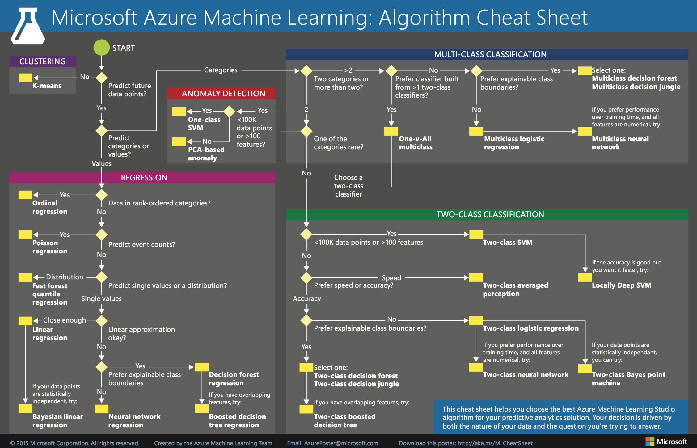

# 资料汇总

[TOC]

积累平时的代码
名词解释
    解释
        select * from table where a=3 limit 10;
> 备注信息：
* [Git简易指南](http://www.bootcss.com/p/git-guide/),[图说Git](http://marklodato.github.io/visual-git-guide/index-en.html)
* [github官方markdown指南](https://guides.github.com/features/mastering-markdown/ "英文版")
* [github readme语法简介](http://blog.csdn.net/guodongxiaren/article/details/23690801?utm_source=tuicool&utm_medium=referral "跟一般markdown语法不同")
* [MarkDown语法笔记（完整版）](http://blog.csdn.net/witnessai1/article/details/52551362)
* [马克飞象markdown语法在线测试](https://maxiang.io/ "可以在线测试MD语言！")
---
流程图：
flow
st=>start: Start:>https://www.zybuluo.com
io=>inputoutput: verification
op=>operation: Your Operation
cond=>condition: Yes or No?
sub=>subroutine: Your Subroutine
e=>end
st->io->op->cond
cond(yes)->e
cond(no)->sub->io
***
## macbook配置
- 汇总

| 功能 | 方法 | 备注 |
|----|:------:|:---- |
| 终端用户名自定义 | 系统偏好设置->共享->编辑电脑名称  | - |
| 画图工具OmniGraffle+Pro | [6下载地址](http://www.onlinedown.net/soft/87746.htm),[注册码](http://blog.csdn.net/x_focus/article/details/41349623);[7下载地址（含许可证）](https://d11.baidupcs.com/file/890a1f15ffddb6f3c3dab4fdadb47912?bkt=p3-000080d1e545b74de7d8e2a7d8017edaf20c&xcode=ff73db6f0d13a10269722ca0706f4f2d57cb92d68ca6af42837047dfb5e85c39&fid=1610614513-250528-218454854633625&time=1494382563&sign=FDTAXGERLBHS-DCb740ccc5511e5e8fedcff06b081203-HpWzZufk4Ih1Y%2FFYHmSq25HYFyM%3D&to=d11&size=93883767&sta_dx=93883767&sta_cs=11417&sta_ft=dmg&sta_ct=5&sta_mt=0&fm2=MH,Yangquan,Netizen-anywhere,,hunan,ct&newver=1&newfm=1&secfm=1&flow_ver=3&pkey=000080d1e545b74de7d8e2a7d8017edaf20c&sl=83034191&expires=8h&rt=pr&r=580566339&mlogid=3001796489994348567&vuk=1610614513&vbdid=502618811&fin=OmniGraffle+7.2+for+Mac.dmg&fn=OmniGraffle+7.2+for+Mac.dmg&rtype=1&iv=0&dp-logid=3001796489994348567&dp-callid=0.1.1&hps=1&csl=300&csign=SlvW2m2iS5Dhs4IYR0kvCbxY%2BwQ%3D&by=themis)  | 兼容viso，功能强大 |
| 安装pip | sudo easy_install pip  | pip直接安装其他工具 |
|软件包管理器|homebrew安装（[参考地址](http://www.itbulu.com/macbook-wget-install.html)）；安装wget：brew install wget|brew安装命令：ruby -e "$(curl -fsSL https://raw.githubusercontent.com/Homebrew/install/master/install)"|
| 翻墙 | 1.有代理ip的直接设置：网络->高级->代理->勾选网页代理+安全网页代理，输入服务器域名及端口，无需填入账号。2.用[lantern下载](https://github.com/getlantern/forum/issues/833) | 备选方案很多 |
|vim颜色显示|1.vim ~/.vimrc,2.添加colorscheme desert;syntax on |vim [sublime颜色主题](http://www.cnblogs.com/fsjohnhuang/p/3911611.html)|
|vim开发环境|[vim IDE部署](https://github.com/wklken/k-vim)|其他主题包，[vim-go开发环境[(http://blog.csdn.net/chosen0ne/article/details/40782991)|
|shell目录颜色显示|开启方法：编辑~/.bash_profile,增加：export CLICOLOR=1;export LSCOLORS=exfxaxdxcxegedabagacad|注：[如何在shell字符串中显示彩色字符？](http://7938217.blog.51cto.com/7928217/1651807/),显示白色：echo -e "\033[37m white \033[0m"|
|mac免密码远程登录|使用ssh创建rsa公钥密码。基本步骤：*   1.ssh-keygen生成密钥(ssh-keygen -t rsa)  *   2.复制密钥文件到远程机器(scp ~/.ssh/id_rsa.pub wangqiwen@ip.com:/home/wangqiwen/.ssh) *   3.登录远程机器，修改文件权限(cd ~/.ssh && cat id_rsa.pub >> authorized_keys; chmod 644 authorized_keys;chmod 700 ~/.ssh/)|参考地址：[mac无密码登录](http://blog.csdn.net/cdut100/article/details/70277091)|
|chrome浏览器中右键失灵|双指触碰链接时，并未弹出右键菜单，而是“图片另存为”|解决办法：这是由于chrome浏览器上开启了鼠标手势，造成干扰，关闭或删除插件即可|
|image not recognized|dmg文件无法安装，原因：文件损坏，dmg权限不允许任意来源的包；换浏览器|如何开启任意来源包？sudo spctl --master-disable|
|redis安装|brew install redis|使用方法：启动服务，redis-server，连接服务：redis-cli|
|mac mail客户端设置|连接163时，需要先去163邮箱开启pop3/imap选项，通过手机验证码设置连接密码；mail终端配置时填入的密码是连接密码（非登录密码！）|wqw3721|
|安装虚拟机|vmware安装，下载地址|vmware fusion 8激活码：FY75A-06W1M-H85PZ-0XP7T-MZ8E8，ZY7TK-A3D4N-08EUZ-TQN5E-XG2TF，FG1MA-25Y1J-H857P-6MZZE-YZAZ6|
|java|官方下载地址：http://www.oracle.com/technetwork/java/javase/downloads/jdk8-downloads-2133151.html||
|Web服务|[Mac OS 启用web服务](http://www.jianshu.com/p/d006a34a343f),[简网教程](http://www.jianshu.com/p/d006a34a343f)||
|linux 服务器mail|mail command not found|解决方法：sudo yum install mailx;echo "test" (竖线) mail -s "content" wangqiwen@p1.com|

>
wqw:code wangqiwen$ git clone https://github.com/p1cn/backend.git
Cloning into 'backend'...
Username for 'https://github.com': wqw547243068
Password for 'https://wqw547243068@github.com': 
remote: Invalid username or password.
fatal: Authentication failed for 'https://github.com/p1cn/backend.git/'
原因：Github没有fork项目代码，或没加所在机器的sshkey（settings->deplot keys）

## python使用mysql方法
### 安装方法
mac下安装MySQL-python

要想使python可以操作mysql，就需要MySQL-python驱动，它是python 操作mysql必不可少的模块。
- [下载地址](https://pypi.python.org/pypi/MySQL-python/)
- 下载MySQL-python-1.2.5.zip 文件之后直接解压。
- 进入MySQL-python-1.2.5目录:
```shell
python setup.py install
```
### 连接mysql
shell 代码，shell脚本中调用sql脚本
```shell
#mysql初始化-shell
mysql=/usr/local/mysql/bin/mysql
$mysql -uroot -pwqw  < init.sql
```
或者shell脚本中直接执行sql
```shell
mysql=/usr/local/mysql/bin/mysql
$mysql -uroot -p123456 <<EOF  
source /root/temp.sql;  
select current_date();  
delete from tempdb.tb_tmp where id=3;  
select * from tempdb.tb_tmp where id=2;  
EOF
```
- [PostgreSQL学习笔记](http://www.cnblogs.com/stephen-liu74/archive/2012/06/08/2315679.html)

## 爬虫
### python抓取链接二手房数据
- [链家二手房数据分析](https://zhuanlan.zhihu.com/p/25132058)
- [scrapy爬链家成都房价并可视化](https://github.com/happyte/buyhouse)
- [抓知乎爬虫](http://www.csuldw.com/2016/11/05/2016-11-05-simulate-zhihu-login/)

## json使用

### shell中使用json
- #[2016-12-31] shell中使用json
- 安装：
> pip install git+https://github.com/dominictarr/JSON.sh#egg=JSON.sh

- 使用：
```shell
echo '{"a":2,"b":[3,6,8]}' |JSON.sh
```
详情参考：https://github.com/dominictarr/JSON.sh

## 可视化
### 地图数据可视化
- [地图汇](http://www.dituhui.com/)
- [5min上手写echarts第一个图标](http://echarts.baidu.com/echarts2/doc/start.html),[echarts如何从json文件读数据？](http://bbs.csdn.net/topics/392042291)

## 学习资料
### 学习技巧
- @爱可可-爱生活：
 - 互联时代怎么阅读？
 - 读书重在结构生长，形成扎实的支撑；
 - 碎片阅读重在视野的纳新和扩展，开枝散叶；
 - 思考重在提炼和关联，勾画错综的经脉。
 - 学习就是如此，由外而内，无广不精，无博不深，但能坚持必有所成。
 - 网络阅读的最佳实践，不在“取”，在“舍”，知舍才能知关键，料不在多，有感悟一二足矣。
- 学习金字塔


### 数学基础
- [在线几何作图GeoGebra](https://www.geogebra.org/apps/)（源自 [马同学高等数学](http://www.matongxue.com/madocs/244.html)）
- [3Blue1Brown](www.patreon.com/3blue1brown)出品（接受捐助）：[线性代数的本质-Essence of Linear Algebra-视频教程](http://www.3blue1brown.com/)，[Bilibili上《线性代数本质》双语视频教程](http://www.bilibili.com/video/av6731067/).类似视频还有微积分本质
- [行列式的本质（马同学高等数学）](http://www.matongxue.com/madocs/247.html).《数学拾遗》[英文版百度云地址](https://pan.baidu.com/share/link?shareid=1204761446&uk=2416092239&fid=2111748288). 
- [矩阵分解(加法偏)](https://mp.weixin.qq.com/s?src=3&timestamp=1498919864&ver=1&signature=lwM3ouw-FlaVYwhol06JImHUQz-gJ00kBAYkssdiD3pSLwOS48Mv9ntL97readD8AZrXS2q0D28PegS*LE6Cxp88Hy8RPP9VLGdWA29zARcLVFuwHbJJl8SPtB*dq7njgt7suMGouSV-FP5b9BlFeWtQ8XNSO9aJyrh8mBJNYS8=),[矩阵分解(乘法篇)，很不错](https://mp.weixin.qq.com/s?src=3&timestamp=1498919864&ver=1&signature=lwM3ouw-FlaVYwhol06JImHUQz-gJ00kBAYkssdiD3q4iNXi-7lf9GzKeq2CvP0yAofBNF7OoCG21M1YDLrrhHHA15K4rrKyP1FFPjQtmNGv0yv5IFeA7LmvuBiea1Xrsa79Gf8c6IT1JiTdra-mU8JNHdj0zp-lYaJUUfp0CHw=)
- [如何通俗的解释放射变换](http://www.matongxue.com/madocs/244.html),[生动讲解矩阵的空间变换](http://blog.csdn.net/a396901990/article/details/44905791)：平移、缩放、旋转、对称（xy或原点）、错切、组合。[行列式的本质是什么？---万门大学童哲的解释](https://www.zhihu.com/question/36966326/answer/70687817):行列式就是线性变换的放大率！理解了行列式的物理意义，很多性质你根本就瞬间理解到忘不了！


- 行列式：行列式，记作 det(A)，是一个将方阵 A 映射到实数的函数。行列式等于矩阵特 征值的乘积。行列式的绝对值可以用来衡量矩阵参与矩阵乘法后空间扩大或者缩小 了多少。如果行列式是 0，那么空间至少沿着某一维完全收缩了，使其失去了所有的 体积。如果行列式是 1，那么这个转换保持空间体积不变
- [六大概率分布](http://www.csuldw.com/2016/08/19/2016-08-19-probability-distributions/)
- [最优化算法-避开鞍点](http://www.csuldw.com/2016/07/10/2016-07-10-saddlepoints/)
- [频率学派与贝叶斯学派之争](http://www.cnblogs.com/549294286/archive/2013/04/08/3009073.html)：[知乎网友解释](https://www.zhihu.com/question/20587681/answer/21294468),频率学派最先出现，疯狂打压新生的贝叶斯学派，贝叶斯很凄惨，就跟艺术圈的梵高一样，死后的论文才被自己的学生发表，经过拉普拉斯之手发扬光大，目前二派就像华山派的剑宗和气宗。频率学派挺煞笔的，非得做大量实验才能给出结论，比如你今年高考考上北大的概率是多少啊？频率学派就让你考100次，然后用考上的次数除以100。而贝叶斯学派会找几个高考特级教师对你进行一下考前测验和评估，然后让这几个教师给出一个主观的可能性，比如说：你有9成的把握考上北大。
   - 这个区别说大也大，说小也小。（1）往大里说，世界观就不同，频率派认为参数是客观存在，不会改变，虽然未知，但却是固定值；贝叶斯派则认为参数是随机值，因为没有观察到，那么和是一个随机数也没有什么区别，因此参数也可以有分布，个人认为这个和量子力学某些观点不谋而合。（2） 往小处说，频率派最常关心的是似然函数，而贝叶斯派最常关心的是后验分布。我们会发现，后验分布其实就是似然函数乘以先验分布再normalize一下使其积分到1。因此两者的很多方法都是相通的。贝叶斯派因为所有的参数都是随机变量，都有分布，因此可以使用一些基于采样的方法（如MCMC）使得我们更容易构建复杂模型。频率派的优点则是没有假设一个先验分布，因此更加客观，也更加无偏，在一些保守的领域（比如制药业、法律）比贝叶斯方法更受到信任。
   - 频率 vs 贝叶斯 =   P(X;w)  vs  P(X|w) 或 P(X,w) 
   - 频率学派认为参数固定，通过无数字实验可以估计出参数值——客观；
   - 贝叶斯学派认为参数和数据都是随机的，参数也服从一定的分布，需要借助经验——主观
- [统计学基础知识【脑图笔记】](http://www.cnblogs.com/xiaofeng1234/p/5987845.html)
- 大矩阵相乘：[分布式版本](http://weibo.com/ttarticle/p/show?id=2309404091643656571557),[MapReduce实现矩阵相乘](http://blog.csdn.net/jiangsanfeng1111/article/details/51025744)，[Hadoop实现大矩阵相乘之我见](http://www.cnblogs.com/eczhou/p/3340731.html)
 - A大B小(内存受限)
 
 - AB都大(内存受限)
 
 - 不受内存限制（最小粒度）
 
- 其他
### 计算机基础
- 排序算法总结：[视觉感受常见排序算法](http://blog.jobbole.com/11745/)

- [海量数据处理算法总结【超详解】](http://www.cnblogs.com/ECJTUACM-873284962/p/6910842.html)
### 分布式计算
- [flume+kafka+hdfs+storm组合](http://www.aboutyun.com/thread-6855-1-1.html)
### 推荐系统
- [项量：关于LDA，pLSA，SVD和Word2vector的一些看法](https://zhuanlan.zhihu.com/p/21377575)：
  - SVD算法是指在SVD的基础上引入隐式反馈，使用用户的历史浏览数据、用户历史评分数据、电影的历史浏览数据、电影的历史评分数据等作为新的参数
  - LSA最初是用在语义检索上，为了解决一词多义和一义多词的问题,将词语（term）中的concept提取出来，建立一个词语和概念的关联关系（t-c relationship），这样一个文档就能表示成为概念的向量。这样输入一段检索词之后，就可以先将检索词转换为概念，再通过概念去匹配文档。在实际实现这个思想时，LSA使用了SVD分解的数学手段.x=T*S*D
  - PLSA和LSA基础思想是相同的，都是希望能从term中抽象出概念，但是具体实现的方法不相同。PLSA使用了概率模型，并且使用EM算法来估计P（t|c）和P（c|d）矩阵.LDA是pLSA的generalization：一方面LDA的hyperparameter设为特定值的时候，就specialize成pLSA了
  - NMF：一种矩阵分解，要求输入矩阵元素非负，目标和 SVD 一样。
  - pLSA：SVD 的一种概率解释方法——要求矩阵元素是非负整数。LDA：pLSA 加上 topics 的 Dirichlet 先验分布后得到的 Bayesian model，数学上更漂亮。为什么是 Dirichlet 先验分布，主要是利用了 Dirichlet 和 multinomial 分布的共轭性，方便计算。
- [从item-base到svd再到rbm，多种Collaborative Filtering(协同过滤算法)从原理到实现](http://blog.csdn.net/dark_scope/article/details/17228643)
- 案例分享：[世纪佳缘推荐系统经验分享](http://www.csdn.net/article/2015-02-15/2823976)
- 《推荐系统实践》[阅读笔记：LFM模型、图模型、slop one和SVD算法](http://www.aiuxian.com/article/p-952427.html)
- 实时推荐系统
 - [实时推荐系统的三种方式](http://www.jianshu.com/p/356656ce2901)
### 机器学习
#### 特征工程
- 江湖名言：<font color=#0099ff size=5 face="黑体">数据和特征决定了机器学习的上限，而模型和算法只是逼近这个上限而已</font>
- [知乎：特征工程到底是什么](https://www.zhihu.com/question/29316149)
 - [使用sklearn做特征工程](http://www.cnblogs.com/jasonfreak/p/5448385.html)
 - [使用python进行描述性统计](http://www.cnblogs.com/jasonfreak/p/5441512.html)
 - [使用sklearn优雅的进行数据挖掘](http://www.cnblogs.com/jasonfreak/p/5448462.html)
 特征工程常用方法：

- 不平衡数据集如何处理？研究表明，在某些应用下，1∶35的比例就会使某些分类方法无效，甚至1∶10的比例也会使某些分类方法无效。
 - [分类问题中不平衡数据集的解决方案](https://www.52ml.net/16294.html)，正负样本玄虚
 - 1.过抽样：简单赋值负样本——最常用，容易过拟合，SVM模型里用途不大
 - 2.欠抽样：随机减少正样本——造成信息丢失
 - 3.算法层面：（1）重构训练集，按错分代价对训练集重构（2）代价敏感函数，大样本高代价，小样本低代价
 - 4.特征选择：选取有区分度的特征
 - [解决真实世界的问题：如何在不平衡数据集上使用机器学习](https://www.52ml.net/17957.html?utm_source=tuicool&utm_medium=referral)
 
#### 算法总结
- 微软-ML算法指南：[pdf版下载地址](https://docs.microsoft.com/en-us/azure/machine-learning/machine-learning-algorithm-cheat-sheet)

 - [详细讲解](How to choose algorithms for Microsoft Azure Machine Learning)
- [scikit-learn官方总结](http://scikit-learn.org/stable/tutorial/machine_learning_map/index.html#)，Scikit-learn Cookbook:[英文本](https://www.packtpub.com/big-data-and-business-intelligence/scikit-learn-cookbook),[中文译本](https://www.gitbook.com/book/wizardforcel/sklearn-cookbook/details)，[MarkDown格式](http://git.oschina.net/wizardforcel/sklearn-cb/blob/master/SUMMARY.md)

- 算法对比
《统计学习方法》总结：


- [xgboost: 速度快效果好的boosting模型](https://cos.name/2015/03/xgboost/)
#### 异常检测
- IsolationForest。欺诈等是一系列的异常孤立点，而IsolationForest则是检测这类孤立点的一个有效算法。无需样本标记、线性时间复杂度。一般情况下要比OneClasSVM等表现要好。尤其是对非高斯分布的样本空间。
#### 机器学习经验总结
- [Google机器学习经验总结](http://martin.zinkevich.org/rules_of_ml/rules_of_ml.pdf)
- [pluskid总结的SVM系列文章](http://blog.pluskid.org/?page_id=683)（浙大计算机，MIT博士，跟陈天奇和李沐一块做过Mxnet）

#### 流形学习
- 什么是流形学习？传统的机器学习方法中，数据点和数据点之间的距离和映射函数f都是定义在欧式空间中的，然而在实际情况中，这些数据点可能不是分布在欧式空间中的，因此传统欧式空间的度量难以用于真实世界的非线性数据，从而需要对数据的分布引入新的假设。流形(Manifold)是局部具有欧式空间性质的空间，包括各种纬度的曲线曲面，例如球体、弯曲的平面等。流形是线性子空间的一种非线性推广。参考[流形学习的简单介绍](https://jlunevermore.github.io/2016/06/25/43.%E6%B5%81%E5%BD%A2%E5%AD%A6%E4%B9%A0/)
- 流形学习：本质上，流形学习就是给数据降维的过程。这里假设数据是一个随机样本，采样自一个高维欧氏空间中的流形（manifold），流形学习的任务就是把这个高维流形映射到一个低维（例如2维）的空间里。流形学习可以分为线性算法和非线性算法，前者包括主成分分析（PCA）和线性判别分析（LDA），后者包括等距映射（Isomap），拉普拉斯特征映射（LE）等。流形学习可以用于特征的降维和提取，为后续的基于特征的分析，如聚类和分类，做铺垫，也可以直接应用于数据可视化等。注：摘自[集智百科流形学习（优质，包含代码及案例）](http://wiki.swarma.net/index.php/%E6%B5%81%E5%BD%A2%E5%AD%A6%E4%B9%A0)。
 - 拟合线性的流形学习模型：LLE, LTSA, Hessian LLE, 和Modified LLE
 - 拟合非线性的流形学习模型：Isomap，MDS和Spectral Embedding
 - 效果示意如下：
#### 降维
 常见的pca属于无监督，lda有监督,常用降维方法如下图。
 - t-SNE是深度学习大牛Hinton和lvdmaaten（他的弟子？）在2008年提出的，lvdmaaten对t-SNE有个主页介绍：[tsne](http://lvdmaaten.github.io/tsne/),包括论文以及各种编程语言的实现,t-SNE是非线性方法，非常适用于高维数据降维到2维或者3维，进行可视化,具体参考[t-SNE原理及python实现](http://blog.csdn.net/jyl1999xxxx/article/details/53138975)
 - 其他方法参考[流形学习](http://blog.csdn.net/zhulingchen/article/details/2123129),[MNIST数据集降维可视化效果展示(经典)](http://colah.github.io/posts/2014-10-Visualizing-MNIST/)
### 深度学习
神经网络发展历史

神经网络网络结构变化

当然，光有强大的内在能力，并不一定能成功。一个成功的技术与方法，不仅需要内因的作用，还需要时势与环境的配合。神经网络的发展背后的外在原因可以被总结为：更强的计算性能，更多的数据，以及更好的训练方法。只有满足这些条件时，神经网络的函数拟合能力才能得已体现

- 深度学习书籍：[Deep Learning中文版](https://exacity.github.io/deeplearningbook-chinese/),[英文版](http://www.deeplearningbook.org/front_matter.pdf),[Andrej Karpathy博客](http://karpathy.github.io/neuralnets/),[Colah's Blog](http://colah.github.io/),[Neural Networks, Manifolds, and Topology](http://colah.github.io/posts/2014-03-NN-Manifolds-Topology/),[Understanding LSTM Networks](http://colah.github.io/posts/2015-08-Understanding-LSTMs/),[印度人总结的cnn笔记](https://deepnotes.io/implementing-cnn)
- [一文读懂深度学习](http://www.36dsj.com/archives/20382)，[深度学习：像人脑一样深层次思考](http://blog.csdn.net/yinlili2010/article/details/47760389)
- Deep Learning（深度学习）学习笔记整理[第一部分](http://blog.csdn.net/zouxy09/article/details/8775360/)|[第二部分](http://blog.csdn.net/zouxy09/article/details/8775488)|[第三部分](http://blog.csdn.net/zouxy09/article/details/8775518)|[第四部分](http://blog.csdn.net/zouxy09/article/details/8775524)|[第五部分](http://blog.csdn.net/zouxy09/article/details/8777094)|[第六部分](http://blog.csdn.net/zouxy09/article/details/8781396)|[第七部分](http://blog.csdn.net/zouxy09/article/details/8781543)|[第八部分](http://blog.csdn.net/zouxy09/article/details/8782018)
- [深度学习为何要深?](https://zhuanlan.zhihu.com/p/22888385),[超智能体gitbook](https://www.gitbook.com/book/yjango/superorganism/details),[台大李宏毅：一天搞懂深度学习](http://v.youku.com/v_show/id_XMTY5NDUzNjIxNg==.html?from=s1.8-1-1.2&spm=0.0.0.0.LZsB12%EF%BC%8C%E4%B8%80%E5%A4%A9%E6%90%9E%E6%87%82%E6%B7%B1%E5%BA%A6%E5%AD%B8%E7%BF%92--%E5%AD%B8%E7%BF%92%E5%BF%83%E5%BE%97)，[CNN原理3D交互演示](http://scs.ryerson.ca/~aharley/vis/conv/)，[Gentlest Introduction to Tensorflow-日本人Khor SoonHin](https://www.youtube.com/watch?v=dYhrCUFN0eM&feature=youtu.be)，中文翻译版：小白也能懂的TensorFlow介绍[上](https://baijiahao.baidu.com/po/feed/share?wfr=spider&for=pc&context=%7B%22sourceFrom%22%3A%22bjh%22%2C%22nid%22%3A%22news_3418700520043930080%22%7D),[下](https://www.jiqizhixin.com/articles/67507027-b7e2-4597-b510-2e060d64e1a3)；[TensorBoard神经网络训练在线演示](http://playground.tensorflow.org/#activation=tanh&batchSize=10&dataset=circle&regDataset=reg-plane&learningRate=0.03&regularizationRate=0&noise=0&networkShape=4,2&seed=0.45786&showTestData=false&discretize=false&percTrainData=50&x=true&y=true&xTimesY=false&xSquared=false&ySquared=false&cosX=false&sinX=false&cosY=false&sinY=false&collectStats=false&problem=classification&initZero=false&hideText=false), [Yann LeCun连发三弹：人人都懂的深度学习基本原理（附视频）](https://www.leiphone.com/news/201612/Sjkmer9Kto5ILxFk.html?viewType=weixin)
- [上海复旦大学吴立德教授的《深度学习课程》](http://list.youku.com/albumlist/show?id=21508721&ascending=1&page=1),[张俊林：深度学习在搜索推荐领域的应用](http://blog.csdn.net/malefactor/article/details/52040228#0-tsina-1-63822-397232819ff9a47a7b7e80a40613cfe1)
- [深度学习](http://my.tv.sohu.com/pl/9161916/84849655.shtml)，[从神经元到深度学习](http://www.36dsj.com/archives/39775),神经网络与深度学习：[英文网址](http://neuralnetworksanddeeplearning.com/)，[中文版下载地址](http://download.csdn.net/detail/pb09210/9556832)
- [寒小阳：深度学习视频](http://my.tv.sohu.com/pl/9161916/84849655.shtml)
- 案例及Demo：[ClarifAI图像视频物体识别](https://www.clarifai.com/demo)

### 知识图谱
- [精益知识图谱方法论](http://blog.memect.cn/?p=2005)，文因互联鲍捷组件的[北京知识图谱学习班](https://github.com/memect/kg-beijing),[知识管理和语义搜索的哲学思考](http://blog.memect.cn/?p=3022),更多资料参考[将门创业历届活动嘉宾视频及ppt](https://mp.weixin.qq.com/s?__biz=MzAxMzc2NDAxOQ==&mid=502876225&idx=1&sn=25894a894cc2c58214ddde13e0a8ef93&chksm=03907c9d34e7f58b57b068d0e7e74ac3db935a131cc7955478b58a98b9bc5c2b239c8ee03129&mpshare=1&scene=23&srcid=1201jRGgplUzlGGggjBesJuI#rd), [八一八聊天机器人](https://zhuanlan.zhihu.com/p/25190575)，[聊天机器人终极设计指南](http://www.woshipm.com/pd/441725.html)，[一文看懂聊天机器人的所有猫腻](http://www.eeworld.com.cn/qrs/article_2016081529734.html)
### 数据挖掘
- [谁说菜鸟不会数据分析【脑图笔记】](http://www.cnblogs.com/xiaofeng1234/p/5997018.html?from=timeline)
- [SQL必知必会【脑图笔记】](http://www.cnblogs.com/xiaofeng1234/p/6024479.html)
- 经验总结：[以什么姿势进入DataMining会少走弯路？](http://weibo.com/ttarticle/p/show?id=2309403973170330790744)
## IT资讯
- 查公司信息：[天眼查](http://www.tianyancha.com/),[IT桔子](https://www.itjuzi.com/)
- [互联网黑名单](https://github.com/shengxinjing/programmer-job-blacklist)
- 股权信息：[股权周刊](https://zhuanlan.zhihu.com/guquanzhoukan)(各种股权纠纷案例,作者[邓永权](https://www.zhihu.com/people/guquanzhoukan/answers))。[【干货】创业公司融资时如何分配股权？融资后一般怎么稀释？](http://bbs.pinggu.org/thread-4526409-1-1.html)
- [程序员跳槽全攻略-读书笔记](http://www.cnblogs.com/coderland/p/5903051.html)

## 工具
- 视频下载工具：
 - [硕鼠](http://www.flvcd.com/)(可以下载流视频，可按专辑下载)，[硕鼠Mac版下载地址](http://www.pc6.com/mac/118056.html)（官网地址有问题）
 - [维棠](http://www.vidown.cn/)
 - YouTube视频下载：(更多方法参考知乎帖子：[如何下载youtube视频](https://www.zhihu.com/question/51714507?sort=created))
  - （1）每个视频域名稍作修改即可（youtube.com->kissyoutube.com）,[SaveMedia](https://savemedia.com/)提供，在线下载+系列视频自动推荐
  - (2) python代码下载,pip3 install you-get,you-get 'https://www.youtube.com/watch?v=jNQXAC9IVRw', 支持的视频网站范围广
  - (3) [clipconverter](http://www.clipconverter.cc/)
- [lantern下载](https://github.com/getlantern/forum/issues/833)
- [在线代码着色器](http://tool.oschina.net/highlight),[实时英文拼写检测](https://app.grammarly.com/)
- [如何使用VIM搭建IDE？](http://harttle.com/2015/11/04/vim-ide.html),
### 实验评估
- 第一种：<font color=#0099ff size=5 face="黑体">A/B-Test</font>. [什么是ab-test？](https://www.zhihu.com/question/20045543/answer/59025552)
 - A/B Test,也称为对比测试,是让两个版本的登陆页面的相互pk测试。看看哪个版本能更好地引导访问者达到你的预设目标,如注册或订阅。
 - [工程实施：叫你如何对产品进行AB Test？](http://blog.csdn.net/weiguang_123/article/details/49203239)，包含服务端、客户端如何实施ab-test，及各自的优缺点
- [ab-test有什么局限性？](https://www.zhihu.com/question/19631253)
 - 首先，A/B测试只有在关键效绩指标(KPI, or Key Performance Indicator)单一，且这个单一明确的目标可以被电脑量化时，适用
 - 其次，A/B测试相比起一些别的测试手段，如纸本原型(paper prototyping)，需要的工作量大、时间长，对设计的要求也相对较高。
 - 另外，A/B测试之所以进行，唯一原因是对结果的追求。但相对应的测试结果通常是短期、即刻的用户行为，比如购买、注册、点击等。
 - 此外，A/B测试并不能提供用户行为的具体细节。A/B测试的结果也仅限于被测试的两个选项：如果12号字比16号字为你的网站带来多1%的用户浏览时间，那10号字呢？8号呢？A/B测试并不能帮助你作更多的、长远的决定。
 - A/B测试还有别的缺点：需要的用户人数大，可能的影响因素多，可以测试的选项数有很大限制等等。
- [吆喝科技-ab-test最佳实践](http://www.appadhoc.com/blog/category/appadhoc/)
- 第二种：<font color=#0099ff size=5 face="黑体">interleaving</font>
- [灰度发布和A/B Test](http://www.jianshu.com/p/88f206f48278)
## 编程语言
- [命令式编程和声明式编程的区别](http://www.vaikan.com/imperative-vs-declarative/)
- [go语言开发者必读的陷阱、技巧、错误](http://www.cnblogs.com/Eilen/p/6944345.html)
- python：[python小白笔记](http://www.cnblogs.com/xiaofeng1234/p/6052051.html)，[python正则表达式](http://www.cnblogs.com/huxi/archive/2010/07/04/1771073.html)
- 老外的Matplotlib教程,[英文原文](http://www.labri.fr/perso/nrougier/teaching/matplotlib/)_,[中文译文](https://liam0205.me/2014/09/11/matplotlib-tutorial-zh-cn/)，[Matplotlib官方艺术馆](http://matplotlib.org/gallery.html)
- [Pandas学习笔记](http://blog.csdn.net/u012675539/article/details/47113147)，[十分钟搞定pandas](http://www.cnblogs.com/chaosimple/p/4153083.html)
- pandas读取excel数据示例
 2016-7-30】
## 视频资源
### 公开课
- 哈佛大学《公正》系列公开课：[哈佛英文主页](http://justiceharvard.org/justicecourse/),[网易中文翻译](http://v.163.com/special/sandel/episode06.html)
 - 自律更自由：康德
- 其他
